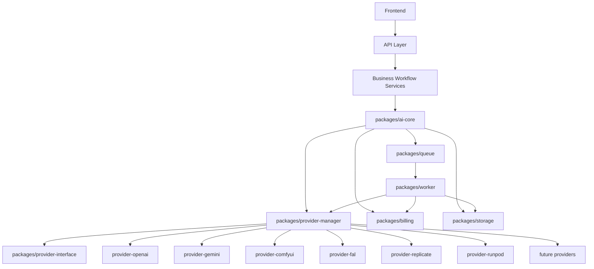

# Provider Plugin Architecture Review

| Field | Value |
|---|---|
| Unique ID | REVIEW-PROVIDER-PLUGIN-001 |
| Version | 1.0.0 |
| Status | Proposed |
| Owner | CTO / Lead Software Architect |
| Dependencies | ADR-005, AI-INDEX-001, AI-PROVIDER-001, AI-JOBS-001, AI-STORAGE-001, AI-COST-001, BE-ARCH-BIBLE-001, API-BIBLE-001, DB-BIBLE-001 |
| Referenced By | DOC-002, ID-REG-001, ADR-006 |
| Cross References | ADR-005, AI-PROVIDER-001, AI-JOBS-001, AI-STORAGE-001, AI-COST-001, BE-ARCH-QUEUE-001, BE-ARCH-STORAGE-001, BE-ARCH-GPU-JOBS-001 |

## Purpose

Define the provider plugin architecture required before refactoring the AI Engine into long-term package boundaries.

## Requirements

- Do not break existing functionality.
- Do not rewrite working code before approval.
- Do not change the Product Bible.
- Business code must never import provider-specific packages.
- Frontend code must not change when providers are added or switched.
- Fake worker and local stub behavior must continue working during migration.
- Providers, storage, queue, billing, model registry, and feature flags must be configured through adapters and configuration.

## 1. Architecture Review

The current `ADR-005` AI Engine foundation already establishes the correct core direction: provider-independent interface, provider registry, local stub provider, not-configured future providers, AI queue, worker, storage abstraction, and cost tracking.

The next architectural risk is package boundary clarity. Today the implementation lives under `src/ai/`, which is acceptable for foundation work, but long-term scale requires a plugin architecture where providers, storage, queue, billing, and worker concerns are independently replaceable.

Architecture verdict:

- Keep the current AI Engine interface and tests as the behavioral contract.
- Refactor gradually into packages after approval.
- Use adapters and dependency inversion; avoid changing product workflow behavior during the package move.
- Add model registry and feature flag concepts before real provider integrations.
- Treat provider-specific SDKs as plugin internals only.

## 2. Folder Refactoring Plan

Proposed package structure:

```text
packages/
  ai-core/
  provider-interface/
  provider-manager/
  provider-openai/
  provider-comfyui/
  provider-gemini/
  provider-fal/
  provider-replicate/
  provider-runpod/
  worker/
  storage/
  billing/
  queue/
```

Package responsibilities:

- `ai-core`: Business-facing `AIEngine` facade and orchestration contracts.
- `provider-interface`: Shared provider types and required provider methods.
- `provider-manager`: Provider registry, routing, fallback, configuration, capabilities, health checks.
- `provider-*`: Provider-specific adapters and SDK/client logic.
- `worker`: Worker loop, job execution, retry coordination, cancellation handling.
- `storage`: Storage adapter interface and implementations for local, Supabase Storage, Cloudflare R2, and S3.
- `billing`: Cost reporting adapter, credit impact reporting, provider cost accounting.
- `queue`: Queue adapter interface and implementations for fake queue, Supabase Queue, Redis Queue, BullMQ, and RabbitMQ.

Migration sequence:

1. Extract interfaces only.
2. Move current local stub into package form.
3. Move queue, worker, storage, and cost tracker behind package exports.
4. Keep `src/ai/aiEngine.ts` as compatibility facade during migration.
5. Add package-level tests that mirror existing `tests/ai-engine.test.ts`.
6. Remove old internal paths only after API compatibility is proven.

## 3. Dependency Graph



Dependency rules:

- Frontend never imports provider packages.
- Business workflow never imports provider packages.
- `ai-core` depends on provider manager, queue, storage, and billing abstractions.
- Provider adapters depend on provider interface only.
- Provider manager may load provider adapters by configuration.
- Worker consumes queue jobs and calls provider manager.
- Billing receives cost events; it does not execute providers.
- Storage stores inputs/outputs; providers do not own durable product metadata.

## 4. Provider Interface

Every provider must implement:

```text
generateImage()
generateVideo()
generateCharacter()
upscale()
editImage()
checkJob()
cancelJob()
healthCheck()
getCapabilities()
estimateCost()
```

Required shared behavior:

- Accept canonical request objects.
- Return canonical job/result objects.
- Report provider name, model, provider job ID, status, cost estimate, duration, resolution, warnings, and output references.
- Never expose provider SDK response objects directly to business code.
- Support cancellation and status polling even if internally simulated by adapter state.

## 5. Storage Interface

Storage adapter methods:

```text
putObject()
getObject()
deleteObject()
getSignedUploadUrl()
getSignedDownloadUrl()
getPublicUrl()
getMetadata()
```

Supported adapters:

- Local Storage.
- Supabase Storage.
- Cloudflare R2.
- S3.

Rules:

- Business code stores and retrieves through adapter interfaces only.
- Storage adapter returns storage keys and signed URLs, not provider-specific SDK objects.
- Durable metadata remains in database-owned records such as `DB-MEDIA-ASSETS-001`.

## 6. Queue Interface

Queue adapter methods:

```text
enqueue()
reserve()
ack()
retry()
fail()
cancel()
release()
deadLetter()
```

Supported adapters:

- Fake Queue.
- Supabase Queue.
- Redis Queue.
- BullMQ.
- RabbitMQ.

Rules:

- Workers consume queue jobs only.
- Queue adapters own delivery semantics.
- Product services do not know the queue provider.
- Retry and dead-letter behavior must be observable.

## 7. Billing Interface

Billing adapter methods:

```text
estimateCost()
recordUsage()
reserveCredits()
commitCredits()
releaseCredits()
recordProviderCost()
```

Every generation must report:

- Credits.
- Provider cost.
- GPU time.
- Duration.
- Resolution.
- Model.
- Provider.
- User.
- Job ID.

Rules:

- Provider cost and user credits remain separate.
- Failed jobs must define refund or retention policy before real providers are connected.
- Billing records must be auditable and reconcilable.

## 8. Migration Plan

Phase A: Planning and contract freeze.

- Approve this review.
- Approve `ADR-006`.
- Define package export rules and compatibility facade.

Phase B: Interface extraction.

- Move `AiProvider` types into `packages/provider-interface`.
- Move storage, queue, and billing interfaces into their packages.
- Keep current imports working through re-exports.

Phase C: Manager and plugin loading.

- Move provider registry into `packages/provider-manager`.
- Add config-driven provider enablement.
- Add capability and health check contract.

Phase D: Worker/package split.

- Move worker logic into `packages/worker`.
- Move queue implementation into `packages/queue`.
- Preserve fake/local queue behavior.

Phase E: Model registry and feature flags.

- Add model registry data model and config loader.
- Add feature flag config for image, video, character, gallery, payment, affiliate, and API.

Phase F: Provider integrations.

- Add one real provider at a time only after dedicated approval.
- Add provider-specific tests, safety review, cost review, and rollback plan.

## 9. Risk Analysis

Major risks:

- Premature package split could break working service-layer behavior.
- Provider-specific SDK types could leak into business code.
- Cost tracking may drift from credit ledger if billing boundaries are unclear.
- Queue semantics differ widely across providers; fake queue behavior may hide production issues.
- Storage signing and public access rules are security-sensitive.
- Feature flags can become scattered if not centrally owned.

Mitigations:

- Preserve compatibility facade until migration is complete.
- Add dependency-boundary tests.
- Keep provider adapters behind interface package.
- Add explicit model registry before provider integration.
- Add provider health checks and fallback policy before live traffic.
- Require tests after every migration phase.

## 10. Approval Gate

Do not refactor packages until this architecture is approved.

Approval checklist:

- Provider interface approved.
- Package structure approved.
- Dependency graph approved.
- Queue, storage, billing, model registry, and feature flag boundaries approved.
- Migration sequence approved.
- Rollback plan approved.

## Acceptance Criteria

- Future refactoring can follow this document without guessing package boundaries.
- Business layer remains provider-agnostic.
- Frontend remains unchanged when providers are added.
- Current fake/local worker behavior remains protected during migration.

## Future Plan

After approval, create small refactoring tasks for Phase A and Phase B only. Do not migrate all packages in one change.

## AI Context

Use this as the provider plugin architecture plan. It is not approval to refactor code or connect real AI providers.
